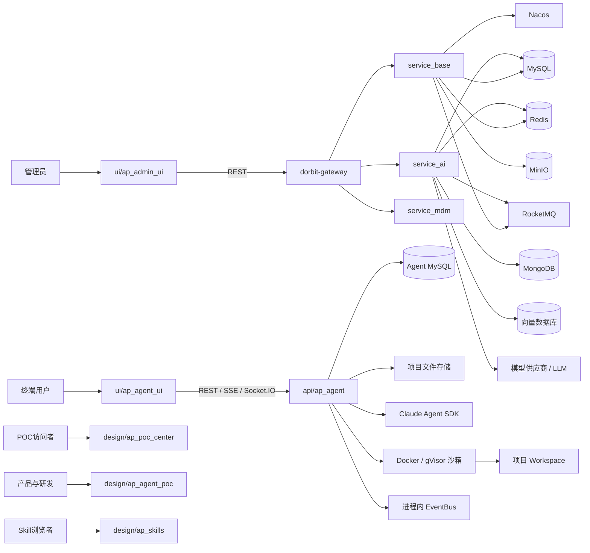

# AP_Dev_Hub 全景分析报告

## 一、执行摘要

### 1. 项目定位

AP_Dev_Hub 不是单一 Monorepo，而是由 8 个独立 Git 仓库组成的产品研发集合，覆盖以下五类能力：

1. POC 与设计原型展示；
2. 面向终端用户的 Agent 工作台；
3. 面向管理员的企业管理后台；
4. Python Agent 执行与协作服务；
5. Java 网关、公共框架和业务微服务平台。

项目已经形成从设计验证到部分生产实现的完整链条：设计仓库负责探索产品形态，Vue 前端负责用户交互，Python 服务负责 Agent 执行和沙箱，Java 平台负责企业管理、AI、BPM、低代码和基础设施能力。

### 2. Git 一致性结论

已检查的 8 个独立仓库均满足：

- 当前分支为 `main`；
- 与对应远程 `origin/main` 为 `0 ahead / 0 behind`；
- 工作区干净；
- 没有未提交或未跟踪文件。

因此，在检查时点，本地代码与各自 GitLab `origin/main` 一致。

需要区分：部分远程仓库的其他分支存在更新，例如 `ui/ap_agent_ui` 的 `origin/dev`，但这不影响当前 `main` 分支的一致性。

### 3. 当前成熟度判断

| 维度 | 判断 |
|---|---|
| 产品覆盖 | 功能范围广，已覆盖 Agent、AI、BPM、低代码、文件、Skill 和知识库 |
| 交互设计 | POC 丰富，Agent 工作台交互形态较完整 |
| 核心服务 | Python Agent 和 Java 平台均已有真实业务实现 |
| 架构完整性 | 已形成前端、网关、业务服务、数据和基础设施链路 |
| 工程交付 | 构建脚本和部分静态检查存在，但测试和版本治理不足 |
| 生产安全 | 存在上线前必须处理的高危问题 |
| 跨仓库治理 | API、权限、环境、版本和部署契约尚未统一 |

### 4. 最重要的风险

1. Java 配置、CI 文件和前端环境文件中存在明文敏感凭据类别；
2. 前端 `VITE_*` 配置会被打包公开，不能放置任何真正的秘密；
3. Python Agent 后端直接挂载 Docker socket，存在宿主机控制边界风险；
4. Java Agent 会话、Agent 和管理接口的资源归属授权需要立即验证；
5. Local Shell 主要依赖文本黑名单，存在绕过风险；
6. 管理员白名单为空时可能默认放开高权限管理操作；
7. Java 项目声明 Java 21，但 CI 使用 JDK 17；
8. Java CI 多处使用 `-Dmaven.test.skip=true`；
9. Actuator、Druid、CORS 和生产配置存在过度暴露或默认不安全问题；
10. 两套 Agent/AI 后端能力和多个前端实现之间的职责边界仍不够清晰。

**总体结论：项目已经具备较强的产品和技术基础，但当前更需要安全止血、权限闭环、工程质量门禁和跨仓库治理，而不是继续无控制地扩展功能。**

## 二、仓库职责矩阵

| 仓库 | 定位 | 语言 | 主要框架/技术 | 主要入口或关键位置 | 主要功能 | 成熟度 |
|---|---|---|---|---|---|---|
| `design/ap_poc_center` | POC 展示门户 | HTML、JavaScript | Vue 3 global build、Tailwind CDN、Font Awesome CDN | `index.html`、`data.js` | POC 卡片、分类、搜索和原型跳转 | 展示级 |
| `design/ap_agent_poc` | Agent 工作台交互原型 | HTML、JavaScript | Vue CDN、Tailwind CDN、iframe、本地 fixture | 基础版和完善版原型目录 | Agent、Project、Task、Workspace、Skill、Todo、Reference 和面板交互 | 原型级 |
| `design/ap_skills` | Skill 展示门户与少量脚本 | HTML、JavaScript、Python | Vue CDN、静态页面、pandas、matplotlib | `portal/`、`skills/` | Skill 元数据、文档、展示下载入口、Excel 图表脚本 | 展示级/工具级 |
| `ui/ap_admin_ui` | 企业管理后台 | TypeScript、Vue | Vue 3、Vite、Pinia、Element Plus、BPMN.js、Monaco、ECharts | `src/main.ts`、`src/permission.ts` | 系统管理、租户、低代码、BPM、AI、知识库、Agent 和 Skill 管理 | 业务前端 |
| `ui/ap_agent_ui` | 终端 Agent 工作台 | TypeScript、JavaScript、Vue | Vue 3、Vite、Pinia、SSE、Socket.IO、Monaco、CodeMirror、Mermaid | `ap-agent/index.vue`、`useChatStore.js` | 对话、项目、文件、工作空间、Skill、团队和实时事件 | 业务前端 |
| `api/ap_agent` | Python Agent 后端 | Python | FastAPI、SQLAlchemy Async、MySQL、PyJWT、Claude Agent SDK、Docker/gVisor | `main.py`、`config.py` | Agent 执行、SSE、工具调用、文件、Skill、产出物、引用、沙箱 | 核心服务 |
| `api/ap_dorbit_framework` | Java 公共框架与 Starter 平台 | Java、Maven | Spring Boot、Spring Cloud、MyBatis-Plus、Redis、RocketMQ、Feign、MinIO、Flowable | `pom.xml`、`dorbit-framework/` | Web、安全、数据库、缓存、RPC、MQ、文件、租户、监控和公共 SDK | 平台基础 |
| `api/ap_dorbit_api` | Java 业务微服务集合 | Java、Maven | Spring Boot、Nacos、MyBatis-Plus、Redis、RocketMQ、Feign、BPM、AI 模块 | `service_ai/`、`service_base/` | Gateway、System、Infra、BPM、DCode、AI、DNova、Harness 和 MDM | 业务平台 |

### Java 仓库内部结构

#### `ap_dorbit_framework`

主要模块包括：

- `dorbit-dependencies`：统一依赖版本；
- `dorbit-framework`：公共 Starter 聚合；
- `dorbit-module-sdks`：BPM、Infra、System 等模块 API SDK；
- common、web、security、mybatis、redis、rpc、mq、file、excel、tenant、monitor、notice、sms、smtp、dict 和测试模块。

当前实际 RPC 体系主要使用 Spring Cloud LoadBalancer 和 OpenFeign。README 中仍保留 Dubbo、ZooKeeper、旧版 Spring Boot 等历史描述，存在文档漂移。

#### `ap_dorbit_api`

`service_ai` 包含：

- `dorbit-module-ai-api`；
- `dorbit-module-ai-biz`；
- `dorbit-module-ai-common`；
- `dorbit-module-ai-ser-dnova`；
- `dorbit-module-ai-ser-harness`；
- SQL Skill 模块。

`service_base` 包含：

- `dorbit-gateway`；
- `dorbit-module-system`；
- `dorbit-module-infra`；
- `dorbit-module-bpm`；
- `dorbit-module-dcode`。

## 三、总体架构图



### 1. 设计层

- `ap_poc_center` 汇总和展示 POC；
- `ap_agent_poc` 验证 Agent 工作台交互；
- `ap_skills` 展示 Skill 和文档；
- 这些仓库主要使用静态资源、本地 fixture、CDN 和 iframe。

### 2. 用户端 Agent 层

`ap_agent_ui` 面向终端用户，负责：

- 工作空间和项目导航；
- 对话输入和流式消息；
- Todo、Tool Call、Artifact 和文件树展示；
- Skill 浏览与使用；
- 团队和协作界面；
- SSE 和 Socket.IO 生命周期管理。

### 3. 管理端层

`ap_admin_ui` 面向管理员和业务运营人员，负责：

- 系统和租户管理；
- 角色、菜单、部门和岗位；
- 低代码设计和运行；
- BPMN 流程设计和审批；
- AI、Agent、Tool、Skill、MCP 和知识库管理。

### 4. Python Agent 执行层

`api/ap_agent` 负责终端 Agent 的实时执行和工作区操作，是一条相对独立的 Agent 产品后端。

### 5. Java 企业平台层

`api/ap_dorbit_api` 负责企业级网关和业务平台，`api/ap_dorbit_framework` 提供公共基础能力。

### 6. 数据和基础设施层

包括 MySQL、MongoDB、Redis/Redisson、RocketMQ、Nacos、MinIO 或其他对象存储、向量数据库以及外部模型和 AI 服务。

## 四、核心业务链路

### 4.1 管理后台、低代码、BPM 和 AI 管理链路

```text
管理员
  → ap_admin_ui
  → 登录、Token、用户信息和动态菜单
  → dorbit-gateway
  → service_base / service_ai / service_mdm
  → MySQL、Redis、Nacos、RocketMQ、MinIO、MongoDB、向量库
  → 管理结果返回前端
```

覆盖的业务包括：

- 用户、角色、菜单、岗位、部门；
- 租户、OAuth、通知、短信、邮件和操作日志；
- 低代码表、表单、模块、报表、规则和国际化；
- BPMN 模型、表单、流程定义、流程实例、任务和审批报表；
- AI 模型、API Key、Agent、Tool、Skill、MCP Token；
- 知识库、文档、切片和检索；
- AI Workflow；
- 文件和对象存储。

管理后台的权限控制由前端静态路由、动态菜单、Pinia 权限 Store、Axios 拦截、Java Spring Security、Controller 权限注解以及租户和资源归属校验共同构成。前端隐藏菜单不能代替后端授权。

### 4.2 Agent 工作区、会话、文件、Skill 和 SSE 链路

```text
终端用户
  → ap_agent_ui
  → Conversation API
  → api/ap_agent
  → ConversationService
  → Claude Agent SDK
  → Tool / Skill / Todo / AskUserQuestion / 子Agent
  → 文件系统、FileWatcher、沙箱和 EventBus
  → SSE
  → Pinia 状态
  → 消息、文件树、产出物和工具结果
```

#### Direct Chat

```text
用户消息
  → 保存 user message
  → 读取最近约 20 条上下文
  → chat_llm.astream
  → SSE 持续返回 token
  → 保存 assistant message
  → 推送 done
```

#### Agent Chat

```text
用户消息
  → 查询 Conversation 和 Project
  → 解析 Prompt 和 Skill
  → 创建 AgentRun
  → 准备 workspace/.memory
  → 创建或复用 SDK Client
  → Claude Agent SDK 执行
  → 工具权限回调
  → 文件、命令、搜索、网络、Skill 和子Agent操作
  → 持久化 ToolCall、Reference 和 Assistant Message
  → 推送 message/tool/todo/artifact/file-tree/done/error
```

Agent 后端已实现工作空间、项目、文件、Skill、Artifact、Reference、SSE、AskUserQuestion、Claude Agent SDK、子 Agent、Local Shell、Docker 和 gVisor 等能力。

但 EventBus、SDK Client、锁、AskUserQuestion 状态、Agent 客户端池和容器缓存主要位于进程内，因此当前架构依赖单 worker。若未来多实例部署，必须外置事件、锁、会话和任务状态，或明确采用会话粘性与单实例限制。

## 五、原型到生产映射

| 原型或展示能力 | 真实生产对应 | 当前判断 |
|---|---|---|
| POC 卡片门户 | `ap_poc_center` | 静态展示，不是业务系统 |
| Agent 工作区布局 | `ap_agent_poc`、`ap_agent_ui` | 交互原型较完整，部分已生产化 |
| Agent 对话 | `ap_agent_ui`、`api/ap_agent` | 已有真实 SSE 和 Agent 执行链路 |
| 项目和工作空间 | 原型 fixture、Agent UI、Python 服务 | 已形成真实服务能力 |
| 文件树和预览 | 原型、Agent UI、Python 文件 API | 已部分生产化 |
| Skill 展示 | `ap_skills`、Agent UI、Java AI 平台 | 多套实现并存 |
| Skill 下载 | `ap_skills` | 主要是按钮和提示，不代表真实制品下载 |
| Agent Harness | `ap_agent_poc` | 主要是设计和参考实现 |
| `trae-work参考` API/WebSocket | 参考代码 | 不能视为主原型已接入真实后端 |
| 认证和权限 | Python Agent、Java 平台 | 真实服务具备，原型通常不实现 |
| BPM 和低代码 | Admin UI、Java 服务 | 生产业务能力 |
| Excel 分析 | `tier-percentage-chart.py` | 可执行工具，但工程声明和边界测试不足 |

设计仓库中的能力展示不能直接等同于生产功能完成。每项能力都应单独确认是否调用真实 API、是否持久化、是否包含服务端认证和资源级授权、是否具有失败处理、制品版本和自动化测试。

[Skill Hub 规格](design/ap_skills/.trae/specs/skill-hub/spec.md) 已明确真实后端 API、用户认证、复杂权限管理和真实下载功能属于非目标。因此门户中的下载数量、版本、税务连接器或外部 API 对接描述，应视为展示元数据。

## 六、质量与交付

### 6.1 前端

`ui/ap_admin_ui` 提供 Vite 多环境构建、`vue-tsc --noEmit` 类型检查和 ESLint；`ui/ap_agent_ui` 提供 Vite 多环境构建和 TypeScript 检查。但两个前端都没有形成完整的可执行测试流程，缺少稳定的 unit test、端到端测试以及 SSE、Socket.IO、权限和 Token 刷新测试。

### 6.2 Java 测试和 CI

Java 测试主要集中于 notice、SMS、tenant、file、FTP/Local/S3/SFTP 客户端以及 DSL 和代码生成模块。多个 CI 文件使用 `-Dmaven.test.skip=true`，导致测试可能不被编译和执行，Sonar 也缺少完整测试反馈。

### 6.3 Java 版本

Java POM 多处声明 Java 21，但 CI 中 `JAVA_HOME` 为 JDK 17，可能造成本地、CI 和生产环境之间的构建与运行不一致。应统一 JDK、Maven、编译参数、基础镜像和运行时。

### 6.4 推荐 CI 流程

```text
validate
  ├── secret scan
  ├── dependency audit
  ├── typecheck / lint
  └── API contract validation

unit-test
  ├── Java unit test
  ├── Python unit test
  └── frontend unit test

integration-test
  ├── database
  ├── Redis
  ├── MQ
  ├── external adapter
  └── authorization matrix

build
  ├── frontend bundle
  ├── Maven package
  ├── Python image
  └── sandbox image

security
  ├── SAST
  ├── dependency scan
  ├── container scan
  ├── SBOM
  └── secret scan

release
  ├── artifact signing
  ├── deployment
  ├── health check
  └── rollback verification
```

### 6.5 依赖可复现性

Python 依赖部分使用下限范围，缺少完整 lockfile；两个 Node 前端未发现统一提交的 lockfile，依赖版本存在分叉；Docker 基础镜像使用浮动标签，未固定 digest。建议锁定 Python、Node、Maven 和 Docker 依赖，并生成 SBOM。

### 6.6 文档

`api/ap_agent` 文档相对完整，但仍存在端口、路径和环境配置漂移迹象。`api/ap_dorbit_api/README.md`、`api/ap_dorbit_framework/README.md` 和设计仓库 README 需要更新，补充服务清单、端口、环境变量、依赖、启动顺序、数据库迁移、测试、发布、回滚和运维责任。

## 七、安全风险

### 7.1 P0：必须立即处理

#### P0-1：明文凭据泄漏

在 Java 配置、Skill 服务配置、多个 CI 文件和前端环境文件中发现数据库、Redis、Nacos、MinIO、Jasypt、AI、Nova、SMTP、Sonar 和演示账户等敏感凭据类别。应按“凭据已经泄漏”处理：立即吊销和重新生成，检查 Git 历史、CI 日志、缓存、制品和镜像层，并迁移至受保护变量或 Secret Manager。

#### P0-2：前端 `.env.local` 暴露登录凭据

Vite 会把 `VITE_*` 变量编译进浏览器资源。前端配置中的登录凭据不应继续用于真实环境，应立即轮换并移除，同时分离 local、dev、SIT 和 production 配置。

#### P0-3：Docker socket 直挂

后端能够访问宿主 Docker 守护进程。建议移除直挂，改用受限 Sandbox Broker、独立沙箱节点或 rootless Docker，并限制网络、挂载、镜像、能力和资源。

### 7.2 P0/P1：权限和资源归属

Java 会话的 update、delete、get、share 等操作存在按 ID 查询或操作的逻辑，但没有明显体现当前用户、创建者、共享者或租户条件；Agent 管理 Controller 部分 `@PreAuthorize` 被注释；`AgentManageImpl` 接近空实现。这些问题需要通过授权矩阵和集成测试立即确认。

### 7.3 P1：认证和默认配置

- `ADMIN_USER_IDS` 为空时可能默认允许所有登录用户调用管理操作；
- AAD 自动创建账户使用统一默认密码；
- JWT secret 缺失时进程内随机生成；
- 通过 URL query 传递 access token 可能造成历史、日志和 Referer 泄漏；
- 生产配置缺少数据库、外部服务和管理员配置时没有统一的强制启动校验。

### 7.4 P1：沙箱和 Shell

Local Shell 主要依赖文本黑名单，应专项测试管道、重定向、命令替换、编码、PowerShell、CMD、Python/Node/Java 间接执行、符号链接、后台进程、子进程、工作区外路径和内网访问。黑名单只能作为辅助控制，不能替代容器隔离。

### 7.5 P1：CORS、Actuator 和 Druid

Python 开发模式允许任意 Origin、任意方法和任意请求头并开启 credentials；Java Gateway 也存在 wildcard CORS 与 credentials 组合风险。Java AI 配置存在 Actuator 全端点暴露和 Druid 控制台保护不足迹象。生产应使用明确域名白名单、关闭全端点并保护管理控制台。

### 7.6 P1：固定内网地址和宽松运行配置

Java 配置包含固定内网、localhost、RocketMQ、MongoDB、Redis、Nacos、向量库和对象存储地址，以及 `allow-circular-references=true`、`allow-bean-definition-overriding=true`。生产应关闭宽松选项，所有地址和凭据通过环境级配置注入并进行启动校验。

### 7.7 P2：前端 XSS、source map 和日志

两个前端和部分原型包含富文本或 `v-html` 入口，需要确认不可信输入始终经过可靠净化。同时审查 source map、console、SSE/Socket 日志、localStorage Token、下载、预览和 iframe 的安全配置。

## 八、30/60/90 天路线

### 0—30 天：安全止血与交付基线

- 吊销并轮换所有已提交的数据库、Redis、Nacos、MinIO、AI、Nova、Jasypt、SMTP、Sonar 和演示账户凭据；
- 清理前端 `.env.local` 中的登录信息；
- 检查 Git 历史、CI 日志、缓存、镜像层和制品；
- 建立 Secret Manager、masked/protected variables 和 secret scanning；
- 为 Workspace、Project、Folder、Conversation、File、Skill、Artifact 和 Agent 增加资源归属校验；
- 恢复管理接口权限控制；
- 生产缺少管理员白名单或 JWT secret 时启动失败；
- 取消 AAD 统一默认密码；
- 收紧 CORS、Actuator 和 Druid；
- 统一 Java 21 构建环境；
- 移除 `-Dmaven.test.skip=true`；
- 前端 CI 增加依赖安装、类型检查、Lint 和构建。

### 31—60 天：沙箱隔离、稳定性和 API 契约

- 移除 Agent 后端直接访问宿主 Docker socket；
- 引入受限 Sandbox Broker 或独立沙箱节点；
- 采用 rootless Docker/gVisor；
- 限制容器网络、挂载、镜像、权限和资源；
- 完成 Shell、路径、符号链接、解释器和子进程专项测试；
- 补充 SSE 断线重连、Token 过期、用户取消、超时、Agent 崩溃、AskUserQuestion 恢复和 Socket.IO 并发测试；
- 建立认证、租户、ID、错误码、分页、SSE 事件、文件、Skill 和 AgentRun API 契约。

### 61—90 天：产品收敛和平台治理

- 明确 Python Agent 与 Java AI/Agent 平台的职责边界；
- 统一用户、租户、权限和资源模型；
- 统一 Skill 注册、发布、审核、安装、下载和版本管理；
- 将 POC 交互逐项映射到真实生产功能；
- 统一 Trace ID、User/Tenant/Workspace/Project/Conversation/AgentRun/ToolCall 上下文；
- 增加 Agent 执行、工具失败、SSE 重连、沙箱资源、Token 成本、权限拒绝和文件审计指标；
- 锁定 Python、Node、Maven 和 Docker 依赖；
- 生成 SBOM、扫描漏洞、签名制品并建立兼容矩阵、发布和回滚流程。

## 九、最终结论与上线建议

AP_Dev_Hub 已具备综合产品平台的雏形和部分真实生产能力：Agent 工作区产品形态清晰，Python Agent 服务具有真实的会话、工具、文件、Skill、SSE 和沙箱链路，Java 平台覆盖企业管理、AI、BPM、低代码和基础设施，POC 仓库为产品交互提供了丰富验证素材。

但在以下问题处理前，不建议直接进入真实生产环境：

1. 明文凭据未轮换；
2. 前端公开配置仍包含登录凭据；
3. Docker socket 仍直接暴露给 Agent 后端；
4. 会话、Agent 和租户资源授权未完成矩阵验证；
5. Shell 沙箱绕过面未经过专项测试；
6. 生产 JWT、管理员白名单和 CORS 未强制校验；
7. Actuator 和 Druid 暴露范围未收紧；
8. CI 仍跳过测试或未验证前端构建；
9. Java 21 与 JDK 17 构建环境不一致；
10. 跨仓库 API、版本和部署契约尚未统一。

推荐治理顺序：

```text
凭据轮换
  → 权限闭环
  → 沙箱隔离
  → 生产配置收紧
  → CI 测试门禁
  → 依赖和版本锁定
  → API 与部署契约
  → POC/生产能力收敛
```

本报告基于静态代码、配置、仓库和文档分析；此前未执行依赖安装、前端构建、Maven 构建、Python 运行、自动化测试或运行时攻击验证。因此，授权越权、沙箱绕过、构建兼容性和外部服务连接等结论仍需通过专门测试进一步确认。
